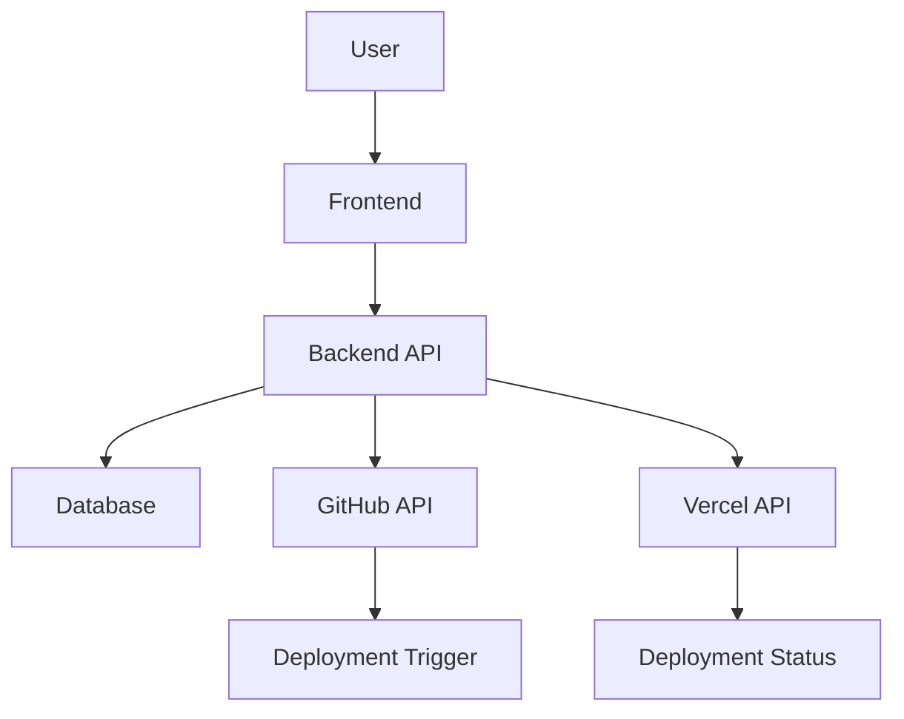

# Current System Architecture

## Overview

Full-stack deployment monitoring application with Node.js backend and Next.js frontend.

## Backend Architecture

### Models
- **User.js**: User authentication and management
- **Deployment.js**: Deployment tracking and status

### API Structure
```
Backend/
├── server.js          # Main server entry point
├── models/            # Data models
├── routes/            # API endpoints
└── .env              # Environment configuration
```

### Technology Stack
- Node.js runtime
- Express.js framework
- MongoDB/Database integration (inferred)
- Environment-based configuration

## Frontend Architecture

### Pages Structure
```
Frontend/pages/
├── index.js           # Landing page
├── login.js           # Authentication
├── signup.js          # User registration
├── dashboard.js       # Main dashboard
├── github.js          # GitHub integration
├── platform.js       # Platform selection
├── platform/vercel.js # Vercel-specific features
└── monitor/[id].js    # Individual deployment monitoring
```

### Technology Stack
- Next.js framework
- React components
- Tailwind CSS styling
- Dynamic routing for monitoring

## Current Integrations

### GitHub
- Repository connection
- Deployment triggers
- Source code management

### Vercel
- Platform-specific deployment handling
- Status monitoring
- Configuration management

## Data Flow



## Identified Extension Points

1. **Platform Abstraction Layer**: Standardize platform integrations
2. **Real-time Updates**: WebSocket connections for live monitoring
3. **Notification System**: Alert users of deployment status changes
4. **Analytics Engine**: Track deployment metrics and performance
5. **Permission System**: Role-based access control for teams