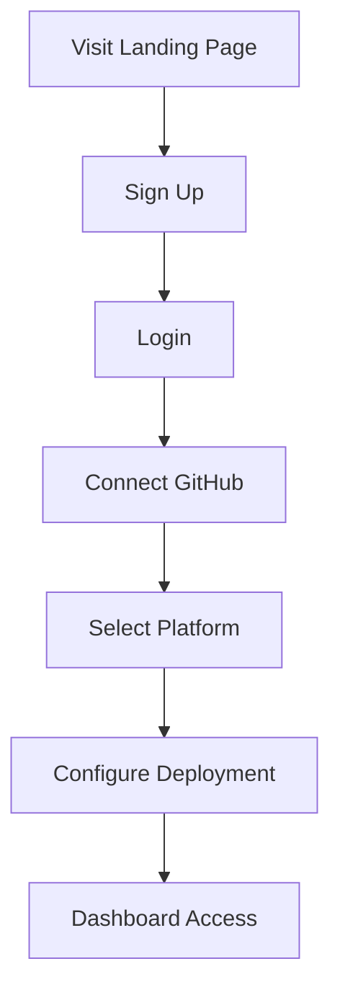
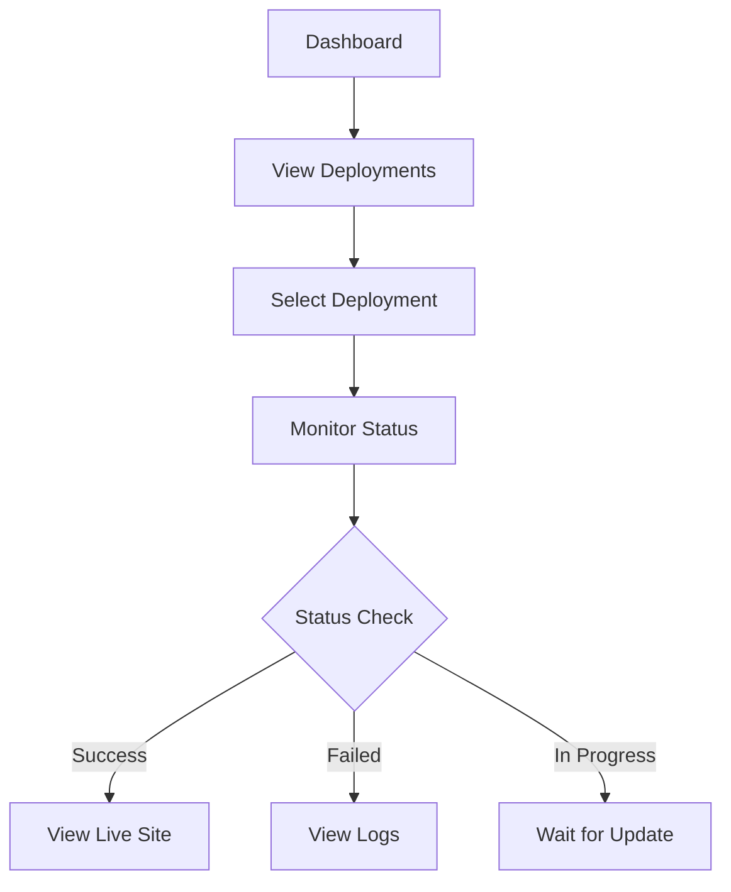
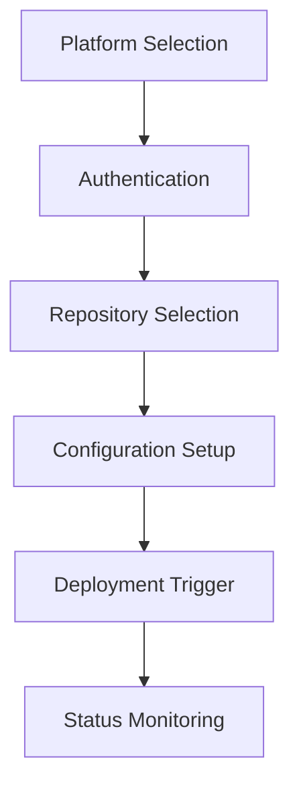
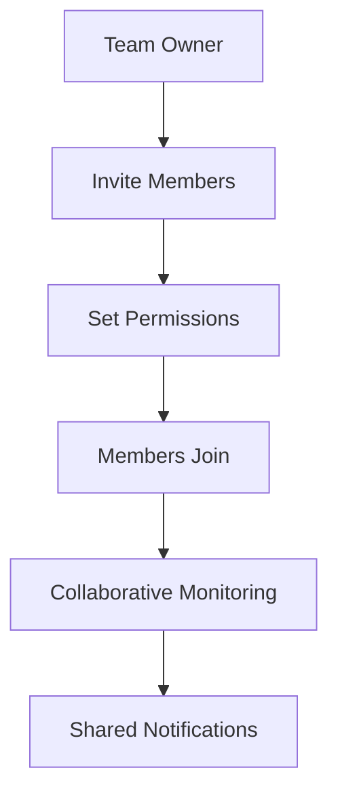
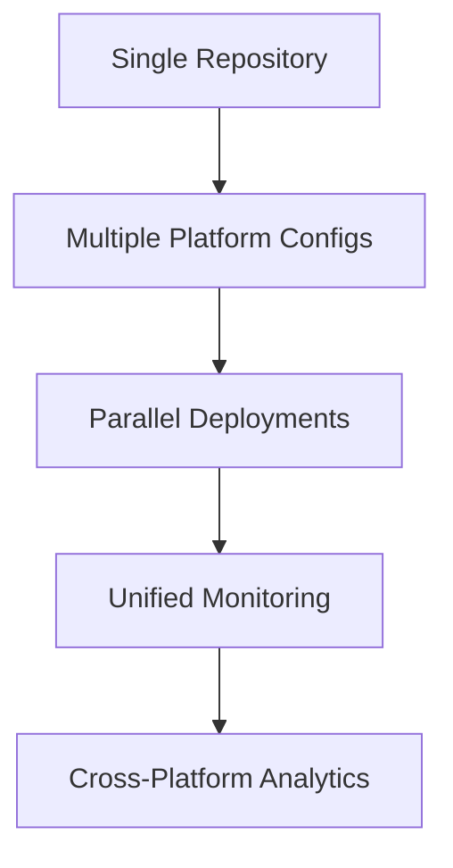
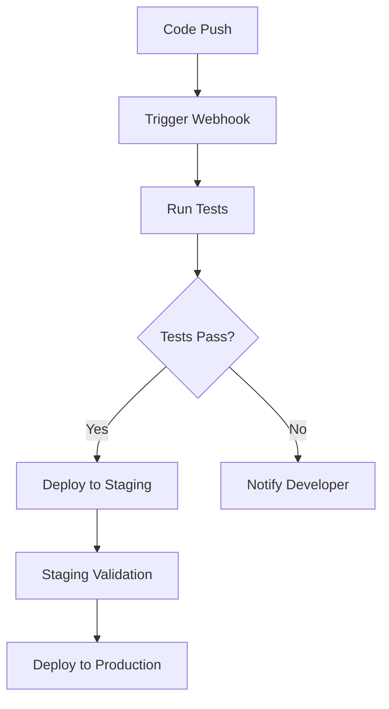

# User Journey Flows

## Current User Flows

### 1. User Onboarding Flow

### 2. Deployment Monitoring Flow

### 3. Platform Integration Flow

## Potential Enhanced Flows

### 1. Team Collaboration Flow

### 2. Multi-Platform Deployment Flow

### 3. Automated Workflow Flow

## Pain Points to Address

1. **Manual Platform Setup**: Streamline multi-platform configuration
2. **Limited Real-time Updates**: Users need to refresh for status changes
3. **No Team Features**: Individual user focus limits collaboration
4. **Basic Monitoring**: Limited insights into deployment performance
5. **Platform Silos**: Each platform handled separately

## Opportunity Areas

1. **Unified Dashboard**: Single view for all platforms and deployments
2. **Smart Notifications**: Context-aware alerts and updates
3. **Deployment Pipelines**: Visual workflow management
4. **Performance Insights**: Analytics and optimization recommendations
5. **Team Workspaces**: Collaborative deployment management